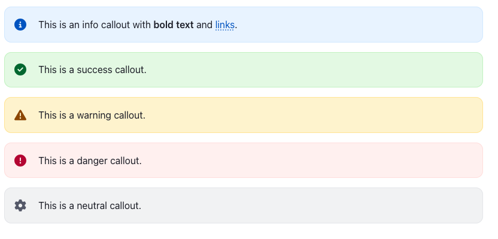
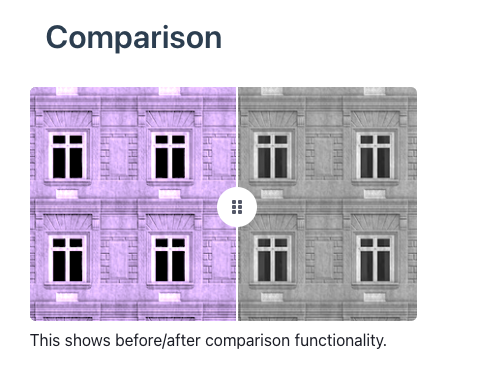
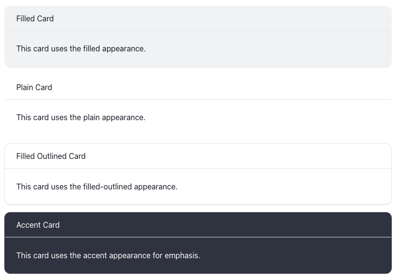
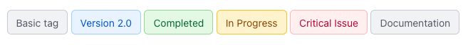
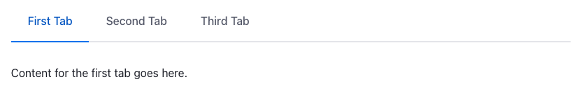
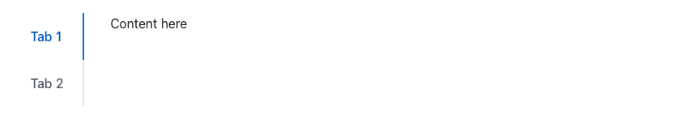

# jekyll-webawesome

This is a plugin for [Jekyll](https://jekyllrb.com/) that transforms custom Markdown syntax into [Web Awesome](https://webawesome.com/) components. Use a simple, intuitive Markdown-like syntax to create rich interactive components in your Jekyll website. The goal is to keep HTML out of Markdown files and create an easier experience for non-developers to update content.

The tranformations have been extracted into a separate project: [markawesome](https://github.com/jannewaren/markawesome), which can be used with any static site generator or Ruby application that processes Markdown.

The context here is a technical documentation website, and being limited to just basic Markdown features often results in a boring wall of text which the user won't read. The aim is to help create a more visually interesting page to read, by mixing in some components like callouts, tabs, cards and collapsible summary/details.

## Web Awesome components

This plugin focuses on the most commonly used Web Awesome components for Jekyll content. Components are organized by support status:

### Currently supported

| Component | Primary Syntax | Alternative Syntax | HTML Output |
|-----------|----------------|-------------------|-------------|
| **Badge** | `!!!variant appearance? pill? attention?` | `:::wa-badge variant appearance?` | `<wa-badge variant="brand" appearance="filled">content</wa-badge>` |
| **Button** | `%%%variant? appearance? size? pill? caret? loading? disabled?` | `:::wa-button attributes?` | `<wa-button variant="brand" size="large" pill>text</wa-button>` or with `href` for links |
| **Callouts** | `:::info size? appearance?` | `:::wa-callout info size? appearance?` | `<wa-callout variant="brand"><wa-icon name="circle-info"></wa-icon>content</wa-callout>` |
| **Card** | `===appearance? orientation?` | `:::wa-card appearance? orientation?` | `<wa-card appearance="filled" orientation="horizontal">content</wa-card>` |
| **Carousel** | `~~~~~~` | `:::wa-carousel` | `<wa-carousel>` with carousel items |
| **Comparison** | `\|\|\|` or `\|\|\|25` | `:::wa-comparison` or `:::wa-comparison 25` | `<wa-comparison>` with before/after slots |
| **Copy Button** | `<<<placement? disabled? duration? labels?` | `:::wa-copy-button attributes?` | `<wa-copy-button value="content" tooltip-placement="right" disabled>` |
| **Details** | `^^^appearance? icon-placement?` | `:::wa-details appearance? icon-placement?` | `<wa-details appearance="..." icon-placement="...">content</wa-details>` |
| **Dialog** | `???params?` | `:::wa-dialog params?` | `<wa-dialog>` with trigger button and content |
| **Tab Group** | `++++++` | `:::wa-tabs` | `<wa-tab-group><wa-tab>content</wa-tab></wa-tab-group>` |
| **Tag** | `@@@brand` | `:::wa-tag brand` | `<wa-tag variant="brand">content</wa-tag>` |

Not all components will make sense to include here, to be included in the "prose" content of a web page. Some components are more suitable to be used in layouts or used in the page as includes, too complicated for this purpose.

Both syntax styles work identically and can be mixed within the same document.

## Installation

Add this line to your application's Gemfile:

```ruby
gem 'jekyll-webawesome'
```

Add the plugin to your Jekyll site's `_config.yml`:

```yaml
plugins:
  - jekyll-webawesome
```

And add configuration options as needed in `_config.yml`:

```yaml
webawesome:
  # Enable debug output to see which files are being processed
  debug: true

  # Control which file types to transform (default: both true)
  transform_pages: true      # Transform pages (like index.md, about.md)
  transform_documents: true  # Transform documents (like blog posts in _posts)
  
  # Enable automatic image-to-dialog transformation (default: false)
  # Can be a simple boolean
  image_dialog: true         # Makes all images clickable and open in dialogs
  
  # Or a hash with options for more control
  image_dialog:
    enabled: true            # Enable the feature
    default_width: 90vh      # Default width for dialogs (e.g., 90vh, 80%, 1200px)
```

And then execute:

```bash
bundle install
```

### Programmatic Configuration

You can also configure the plugin programmatically in a `_plugins/` file or in your gem's initialization:

```ruby
require 'jekyll-webawesome'

Jekyll::WebAwesome.configure do |config|
  config.debug_mode = true
  config.transform_pages = false     # Don't transform pages
  config.transform_documents = true  # Only transform documents (posts)
end
```

## Live Examples

See the plugin in action with a complete Jekyll site showcasing all supported components:

```bash
cd examples
bundle install
bundle exec jekyll serve
```

Then visit `http://localhost:4000` to see all components rendered with Web Awesome styling.

> **Note**: All components support dual syntax. You can use either the primary syntax (shown in examples below) or the alternative `:::wa-component` syntax.

## Components

### Callouts

Create callouts using the `:::` syntax:

```markdown
:::info
This is an info callout with **bold text** and [links](https://example.com).
:::

:::success
This is a success callout.
:::

:::warning
This is a warning callout.
:::

:::danger
This is a danger callout.
:::

:::neutral
This is a neutral callout.
:::

:::brand
This is a brand callout (official variant name, same as `info`).
:::
```

You can also add optional `size` and `appearance` parameters after the variant:

```markdown
:::info small
A compact callout.
:::

:::warning large filled-outlined
A large warning with filled-outlined appearance.
:::

:::success accent
An accent callout that draws more attention.
:::
```

**Size options:** `small`, `medium` (default), `large`

**Appearance options:** `accent`, `filled`, `outlined`, `plain`, `filled-outlined` (default)

These transform into Web Awesome callout components with appropriate icons and styling.



### Comparison

Create before/after image comparisons using the `|||` syntax:

```markdown
|||


|||
```

You can specify the initial position of the comparison slider (0-100):

```markdown
|||25


|||
```

This transforms into a Web Awesome comparison component that lets users interactively compare two images:

```html
<wa-comparison position="25">
  
  
</wa-comparison>
```

The comparison component requires exactly two images within the wrapper:

- The first image becomes the "before" slot
- The second image becomes the "after" slot
- Standard Markdown image syntax is preserved: ``
- Optional position parameter (0-100) sets the initial slider position

> **Note**: If the comparison block doesn't contain exactly two images, it will be left unchanged rather than transformed.



### Cards

Create cards using the `===` syntax:

```markdown
===
This is a basic card with just content.
===
```

#### Cards with Headers

The first heading (`#`) automatically becomes the card header:

```markdown
===
# Card Title
This is the card content that appears in the main area.
===
```

#### Cards with Media

The first image automatically becomes the card media:

```markdown
===

# Featured Content
This card includes both an image and a title.
===
```

#### Cards with Footers

Links at the end of the card content automatically become footer buttons:

```markdown
===
# Get Started
Ready to begin your journey? 
[Learn More](https://example.com)
===
```

#### Complete Cards

You can combine all elements for rich content cards:

```markdown
===filled

# Complete Example
This card has media, header, content, and footer with a filled appearance.
[Get Started](https://example.com)
===
```

#### Card Appearances

You can specify different visual styles:

```markdown
===filled
# Filled Card
This card uses the filled appearance.
===

===plain
# Plain Card
This card uses the plain appearance.
===

===filled-outlined
# Filled Outlined Card
This card uses the filled-outlined appearance.
===

===accent
# Accent Card
This card uses the accent appearance for emphasis.
===
```

#### Card Orientations

Cards can be displayed in horizontal layout for side-by-side presentation:

```markdown
===horizontal

# Horizontal Card
This card displays with a side-by-side layout where media appears on the left.
===

===filled horizontal

# Combined Attributes
You can combine appearance and orientation in any order.
===
```

**Note:** Horizontal cards display media on the left and content on the right. Make sure to set an appropriate max-width for the media slot in your CSS if needed.



### Carousel

Create carousels (image sliders/content rotators) using the `~~~~~~` syntax:

```markdown
~~~~~~
~~~

Beautiful mountain scenery
~~~
~~~

Peaceful ocean waves
~~~
~~~

Walking through the woods
~~~
~~~~~~
```

#### Multiple Slides Per View

Show multiple slides at once by specifying the number:

```markdown
~~~~~~3
~~~
Product 1 content
~~~
~~~
Product 2 content
~~~
~~~
Product 3 content
~~~
~~~
Product 4 content
~~~
~~~~~~
```

#### Navigation and Pagination

Add navigation arrows and pagination dots with keywords:

```markdown
~~~~~~navigation pagination
~~~
First slide
~~~
~~~
Second slide
~~~
~~~
Third slide
~~~
~~~~~~
```

#### Slides Per Move

Control how many slides advance at a time (first number is slides-per-page, second is slides-per-move):

```markdown
~~~~~~3 2 navigation
~~~
Slide 1
~~~
~~~
Slide 2
~~~
~~~
Slide 3
~~~
~~~
Slide 4
~~~
~~~
Slide 5
~~~
~~~~~~
```

This shows 3 slides at a time and moves 2 slides when navigating.

#### Looping

Enable continuous looping with the `loop` keyword:

```markdown
~~~~~~loop navigation
~~~
Slide 1
~~~
~~~
Slide 2
~~~
~~~
Slide 3
~~~
~~~~~~
```

#### Scroll Hint

Add padding to show adjacent slides as a hint using the `scroll-hint` CSS property:

```markdown
~~~~~~scroll-hint:3rem navigation
~~~

~~~
~~~

~~~
~~~

~~~
~~~~~~
```

#### Advanced Options

Combine multiple parameters for full control:

```markdown
~~~~~~3 2 loop navigation pagination scroll-hint:2rem
~~~


# Feature One

Description here
~~~
~~~


# Feature Two

More details
~~~
~~~


# Feature Three

Additional info
~~~
~~~~~~
```

#### Removing Fixed Aspect Ratio

For carousels with **text content, cards, or variable-height slides**, you may want to remove the default `16/9` aspect ratio to let content size naturally:

```markdown
~~~~~~aspect-ratio:auto navigation
~~~
# First Slide

This carousel will size based on content height, not a fixed aspect ratio.

Perfect for text-heavy slides or mixed content.
~~~
~~~
# Second Slide

Another slide with different content height.
~~~
~~~~~~
```

Use `aspect-ratio:auto` or `aspect-ratio:none` to override the default fixed height behavior.

#### Carousel Parameters

| Parameter Type | Syntax | Description |
|----------------|--------|-------------|
| **Slides Per Page** | First number (e.g., `3`) | How many slides visible at once (default: 1) |
| **Slides Per Move** | Second number (e.g., `2`) | How many slides to advance (default: 1) |
| **Loop** | `loop` | Enable continuous looping (default: off) |
| **Navigation** | `navigation` | Show previous/next buttons |
| **Pagination** | `pagination` | Show dot indicators |
| **Autoplay** | `autoplay` | Auto-advance slides |
| **Autoplay Interval** | `autoplay-interval:5000` | Autoplay delay in milliseconds (default: 3000) |
| **Mouse Dragging** | `mouse-dragging` | Enable click-and-drag |
| **Vertical** | `vertical` | Vertical orientation |
| **Scroll Hint** | `scroll-hint:2rem` | Padding to show adjacent slides |
| **Aspect Ratio** | `aspect-ratio:3/2` | Viewport aspect ratio (default: 16/9) |
| **Slide Gap** | `slide-gap:1rem` | Space between slides |

All parameters are optional and can be combined in any order:

```markdown
~~~~~~vertical pagination autoplay
~~~
Content here
~~~
~~~~~~
```

### Tags

Create tags using the `@@@` syntax:

```markdown
@@@
Basic tag
@@@

@@@brand
Version 2.0
@@@

@@@success
Completed
@@@

@@@warning
In Progress
@@@

@@@danger
Critical Issue
@@@

@@@neutral
Documentation
@@@
```

These transform into Web Awesome tag components with appropriate colors and styling.



### Copy Buttons

Create copy-to-clipboard buttons using the `<<<` syntax:

```markdown
<<<
Copy this simple text
<<<

<<<
npm install jekyll-webawesome
<<<
```

Copy buttons support **markdown formatting** in the display text while preserving the original markdown in the clipboard value:

```markdown
<<<
**Copy** this text with *markdown* formatting and `code`
<<<
```

This transforms into a Web Awesome copy button component:

```html
<wa-copy-button value="**Copy** this text with *markdown* formatting and `code`"></wa-copy-button>
```

#### Copy Button Attributes

Copy buttons support flexible parameters in any order:

**Tooltip Placement:**
```markdown
<<<top
Copy with tooltip on top (default)
<<<

<<<right
Copy with tooltip on right
<<<

<<<bottom
Copy with tooltip on bottom
<<<

<<<left
Copy with tooltip on left
<<<
```

**Custom Labels:**
```markdown
<<<copy-label="Click to copy" success-label="Copied!" error-label="Failed"
Customize feedback messages
<<<
```

**Feedback Duration:**
```markdown
<<<2000
Show success feedback for 2 seconds
<<<

<<<250 right
Quick feedback (250ms) with right tooltip
<<<
```

**Disabled State:**
```markdown
<<<disabled
You can't copy this
<<<

<<<disabled bottom
Disabled with bottom tooltip
<<<
```

**Copy from Another Element:**
```markdown
<<<from="my-element"
Copy from element with id="my-element"
<<<

<<<from="my-input.value"
Copy from input's value property
<<<

<<<from="my-link[href]"
Copy from link's href attribute
<<<
```

**Combined Attributes:**
```markdown
<<<right disabled 1500 copy-label="Click to copy"
Multiple attributes in any order
<<<

<<<bottom 3000 copy-label="Copy" success-label="Done!" error-label="Error"
Full customization example
<<<
```

Copy buttons work well for:

- Code snippets and commands
- URLs and configuration values
- Installation instructions
- API keys or tokens
- Any text users might want to copy

> **Note**: The `value` attribute contains the raw text (including any markdown) that gets copied to the clipboard. When using the `from` attribute, the button copies from the referenced element instead. The copy button displays the standard Web Awesome copy icon and handles the clipboard operation automatically.

### Buttons

Create interactive buttons using the `%%%` syntax. Buttons support both regular buttons and link buttons (with `href`):

#### Basic Buttons

```markdown
%%%
Click me
%%%

%%%brand
Submit Form
%%%

%%%success
Save Changes
%%%

%%%danger
Delete Account
%%%
```

These transform into Web Awesome button components with the specified variants.

#### Link Buttons

Create link buttons using markdown link syntax:

```markdown
%%%brand
[Download](https://example.com/file.zip)
%%%

%%%success
[Get Started](https://example.com/start)
%%%

%%%
[Learn More](/docs)
%%%
```

Link buttons use the `href` attribute and behave like links (support CMD/CTRL+click, right-click, etc.).

#### Button Appearance

Control the button's visual appearance with the `appearance` attribute:

```markdown
%%%brand accent
Accent Button
%%%

%%%success filled
Filled Button
%%%

%%%warning outlined
Outlined Button
%%%

%%%danger filled-outlined
Filled-Outlined Button
%%%

%%%neutral plain
Plain Button
%%%
```

**Available appearances:** `accent` (default), `filled`, `outlined`, `filled-outlined`, `plain`

#### Button Sizes

Buttons come in three sizes:

```markdown
%%%small
Small Button
%%%

%%%medium
Medium Button
%%%

%%%large
Large Button
%%%
```

**Available sizes:** `small`, `medium` (default), `large`

#### Pill Buttons

Add the `pill` attribute for rounded edges:

```markdown
%%%pill
Rounded Button
%%%

%%%brand pill large
Large Pill Button
%%%

%%%success pill
[Download Now](https://example.com/download)
%%%
```

#### Dropdown Indicator

Add the `caret` attribute to show a dropdown indicator:

```markdown
%%%caret
Options ▼
%%%

%%%brand caret
Actions ▼
%%%
```

This adds a `with-caret` attribute to display a dropdown arrow, useful for buttons that trigger dropdowns or menus.

#### Button States

Buttons can have loading or disabled states:

```markdown
%%%loading
Processing...
%%%

%%%disabled
Can't Click This
%%%

%%%brand loading
Saving Changes...
%%%

%%%danger disabled
[Delete](https://example.com/delete)
%%%
```

#### Combining Attributes

All button attributes can be combined in any order:

```markdown
%%%brand filled large pill
Big Filled Button
%%%

%%%success outlined small pill caret
Small Options
%%%

%%%danger filled medium disabled
Cannot Delete
%%%

%%%neutral plain large loading
[Processing...](https://example.com/process)
%%%
```

**Attributes work in any order:**
- `variant`: `brand`, `success`, `neutral`, `warning`, `danger`
- `appearance`: `accent`, `filled`, `outlined`, `filled-outlined`, `plain`
- `size`: `small`, `medium`, `large`
- `pill`: rounded edges
- `caret`: dropdown indicator
- `loading`: loading state
- `disabled`: disabled state

### Dialogs

Create interactive dialogs (modals) using the `???` syntax:

```markdown
???
Open Dialog
>>>
This is the dialog content with **markdown** support.
???
```

This creates a trigger button and a dialog that opens when clicked:

```html
<wa-button data-dialog='open dialog-abc123'>Open Dialog</wa-button>
<wa-dialog id='dialog-abc123' label='Open Dialog'>
  <p>This is the dialog content with <strong>markdown</strong> support.</p>
  <wa-button slot='footer' variant='primary' data-dialog='close'>Close</wa-button>
</wa-dialog>
```

#### Dialogs with Headings

The first heading (`#`) automatically becomes the dialog's label (title):

```markdown
???
Show Details
>>>
# Important Information
This is the content of the dialog.
???
```

The button displays "Show Details" and the dialog header shows "Important Information".

#### Dialog Options

You can customize dialog behavior with optional parameters:

**Light Dismiss** - Dialog closes when clicking the overlay:

```markdown
???light-dismiss
Open Dialog
>>>
Click outside to close this dialog.
???
```

**Custom Width** - Set a specific width using CSS units (px, em, rem, vw, vh, %):

```markdown
???600px
Open Dialog
>>>
This dialog is 600 pixels wide.
???

???50vw
Open Wide Dialog
>>>
This dialog is 50% of the viewport width.
???

???40em
Open Dialog
>>>
This dialog is 40em wide.
???
```

**Combining Options** - You can combine multiple options:

```markdown
???light-dismiss 700px
Open Dialog
>>>
# Custom Dialog
This dialog has light dismiss enabled and is 700px wide.
???
```

> **Note**: The dialog uses Web Awesome's declarative `data-dialog` API, so no custom JavaScript is needed. Each dialog gets a unique ID automatically generated from its content. The header with X close button is always shown for accessibility, and a "Close" button is automatically added to the footer.

### Details/Summary (Collapsible Content)

Create collapsible content using the `^^^` syntax:

```markdown
^^^
Click to expand this summary
>>>
This is the detailed content that can be collapsed and expanded.

You can include:
- Lists
- **Bold text**
- [Links](https://example.com)
- Code blocks
^^^
```

You can also specify appearance styles:

```markdown
^^^filled
Filled appearance summary
>>>
Content goes here
^^^

^^^plain
Plain appearance summary  
>>>
Content goes here
^^^

^^^filled-outlined
Filled and outlined appearance summary
>>>
Content goes here
^^^
```

You can also control icon placement (expand/collapse icon location):

```markdown
^^^start
Summary with icon on the start (left)
>>>
The expand/collapse icon appears on the left side
^^^

^^^end
Summary with icon on the end (right)
>>>
The expand/collapse icon appears on the right side (default)
^^^
```

You can combine appearance and icon placement:

```markdown
^^^filled start
Filled appearance with icon on the start
>>>
Content with both styling and icon positioning
^^^

^^^plain end
Plain appearance with icon on the end
>>>
Parameters can be in any order: start filled, filled start, etc.
^^^
```

### Tab Groups

Create tabbed content using the `++++++` syntax for tab groups and `+++` for tabs.

```markdown
++++++
+++ First Tab
Content for the first tab goes here.
+++

+++ Second Tab
Content for the second tab.
+++

+++ Third Tab
Content for the third tab.
+++
++++++
```



You can specify tab placement:

```markdown
++++++start
+++ Tab 1
Content here
+++
+++ Tab 2  
More content
+++
++++++

++++++bottom
+++ Tab 1
Content here
+++
+++ Tab 2
More content  
+++
++++++
```



Supported placements: `top` (default), `bottom`, `start`, `end`.

## Component Reference

### Callout Types

| Type | Icon | Variant |
|------|------|---------|
| `brand` | circle-info | brand |
| `info` | circle-info | brand (alias) |
| `success` | circle-check | success |
| `warning` | triangle-exclamation | warning |
| `danger` | circle-exclamation | danger |
| `neutral` | gear | neutral |

### Callout Options

| Option | Values | Default |
|--------|--------|---------|
| `size` | `small`, `medium`, `large` | `medium` |
| `appearance` | `accent`, `filled`, `outlined`, `plain`, `filled-outlined` | `filled-outlined` |

### Card Options

Cards support flexible attribute ordering using space-separated parameters:

**Appearance:**
| Type | Description |
|------|-------------|
| `outlined` (default) | Default outlined appearance |
| `filled` | Filled background appearance |
| `plain` | Minimal plain appearance |
| `filled-outlined` | Combination of filled and outlined |
| `accent` | Accent appearance for emphasis |

**Orientation:**
| Type | Description |
|------|-------------|
| `vertical` (default) | Traditional stacked card layout |
| `horizontal` | Side-by-side layout with media on the left |

**Note:** All attributes can be combined in any order (e.g., `===filled horizontal` or `===horizontal filled`).

### Card Structure

Cards automatically parse content into these slots:

- **Media**: First image becomes media slot
- **Header**: First `#` heading becomes header slot  
- **Content**: Remaining content becomes main content
- **Footer**: Trailing links become footer buttons

### Carousel Options

| Parameter | Type | Description |
|-----------|------|-------------|
| Slides Per Page | Number (first numeric parameter) | How many slides visible at once (default: 1) |
| Slides Per Move | Number (second numeric parameter) | How many slides to advance (default: 1) |
| `loop` | Boolean | Enable continuous looping (default: off) |
| `navigation` | Boolean | Show previous/next buttons (default: off) |
| `pagination` | Boolean | Show dot indicators (default: off) |
| `autoplay` | Boolean | Auto-advance slides (default: off) |
| `autoplay-interval:value` | Attribute | Autoplay delay in milliseconds (default: 3000, e.g., `5000` for 5 seconds) |
| `mouse-dragging` | Boolean | Enable click-and-drag (default: off) |
| `vertical` | Keyword | Use vertical orientation (default: horizontal) |
| `scroll-hint:value` | CSS Property | Padding to show adjacent slides (e.g., `2rem`, `50px`) |
| `aspect-ratio:value` | CSS Property | Viewport aspect ratio (default: 16/9, e.g., `3/2`, `4/3`). Use `auto` or `none` for content-based height |
| `slide-gap:value` | CSS Property | Space between slides (default: `var(--wa-space-m)`) |

### Tag Variants

| Type | Description |
|------|-------------|
| (none) | Default neutral appearance |
| `brand` | Primary brand color |
| `success` | Success/positive state |
| `warning` | Warning/caution state |
| `danger` | Error/critical state |
| `neutral` | Neutral/informational state |

### Button Attributes

| Attribute | Values | Default | Description |
|-----------|--------|---------|-------------|
| `variant` | `brand`, `success`, `neutral`, `warning`, `danger` | `neutral` | Semantic button color variant |
| `appearance` | `accent`, `filled`, `outlined`, `filled-outlined`, `plain` | `accent` | Visual appearance style |
| `size` | `small`, `medium`, `large` | `medium` | Button size (affects padding and font size) |
| `pill` | keyword | off | Rounded edges for pill-style buttons |
| `caret` | keyword | off | Dropdown indicator (adds `with-caret` attribute) |
| `loading` | keyword | off | Shows loading spinner |
| `disabled` | keyword | off | Disables button interaction |

**Note:** All attributes can be combined in any order. For link buttons, use markdown link syntax: `[Text](url)`.

### Details Appearances

| Type | CSS Class |
|------|-----------|
| `outlined` (default) | outlined |
| `filled` | filled |
| `plain` | plain |
| `filled-outlined` | filled outlined |

### Details Icon Placement

| Position | Description |
|----------|-------------|
| `end` (default) | Icon appears on the right side |
| `start` | Icon appears on the left side |

### Dialog Parameters

| Option | Description |
|--------|-------------|
| `light-dismiss` | Dialog closes when clicking outside/on overlay |
| Width (e.g., `500px`, `50vw`, `40em`) | Sets custom width using CSS units (px, em, rem, vw, vh, %) |

### Dialog Features

- **Automatic ID Generation**: Each dialog gets a unique ID based on MD5 hash of its content
- **Header with X Button**: The header with X close button is always shown for accessibility
- **Auto-close Button**: A "Close" button is automatically added to the footer
- **Declarative API**: Uses Web Awesome's `data-dialog` attributes - no custom JavaScript needed
- **Label Extraction**: First `#` heading becomes the dialog label, or button text is used as fallback
- **Markdown Support**: Full markdown formatting in dialog content

### Image Dialogs (Auto-transformation)

Enable automatic image-to-dialog transformation in your `_config.yml`:

```yaml
webawesome:
  # Simple boolean to enable
  image_dialog: true
  
  # Or configure with options
  image_dialog:
    enabled: true
    default_width: 90vh      # Default width for all image dialogs
```

When enabled, all markdown images automatically become clickable and open in full-size dialogs:

```markdown

```

**Default Width**: Set a default width for all image dialogs in the configuration. Images will use this width unless overridden in the title.

**Control dialog width** by adding a width parameter to the title (overrides default):

```markdown
        # Dialog width: 50%
         # Dialog width: 800px
           # Dialog width: 90% viewport
```

Supported width units: `px`, `em`, `rem`, `vw`, `vh`, `%`, `ch`

**Opt-out** by adding `"nodialog"` to the title:

```markdown

```

**Features:**

- Light-dismiss and headerless dialogs for clean UX
- Thumbnail displays at original size, dialog shows full-size
- Configurable default width for consistent sizing

### Tab Placements

- `top` (default)
- `bottom`
- `start`
- `end`

## Requirements

- Jekyll >= 3.7
- Kramdown >= 2.0
- Web Awesome CSS/JS loaded in your site

## Contributing

Bug reports and pull requests are welcome on GitHub at [https://github.com/jannewaren/jekyll-webawesome](https://github.com/jannewaren/jekyll-webawesome).

## License

The gem is available as open source under the terms of the [MIT License](https://opensource.org/licenses/MIT).
