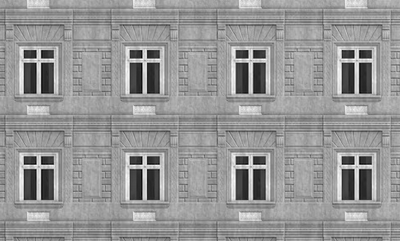
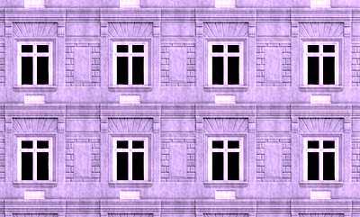

Ex## Comparison

|||

||| of the Web Awesome components and their markdown syntax.

## Callouts

:::info
This is an info callout with **bold text** and [links](https://example.com).
:::

:::success
This is a success callout.
:::

:::warning
This is a warning callout.
:::

:::danger
This is a danger callout.
:::

:::neutral
This is a neutral callout.
:::

## Tags

@@@
Basic tag
@@@

@@@brand
Version 2.0
@@@

@@@success
Completed
@@@

@@@warning
In Progress
@@@

@@@danger
Critical Issue
@@@

@@@neutral
Documentation
@@@

## Comparison

|||25

|||

This shows before/after comparison functionality with initial position at 25%.

## Details/Summary (Collapsible Content)

^^^
Click to expand this summary
>>>
This is the detailed content that can be collapsed and expanded.

You can include:
- Lists
- **Bold text**
- [Links](https://example.com)
- Code blocks
^^^

^^^filled
Filled appearance summary
>>>
Content goes here
^^^

^^^plain
Plain appearance summary  
>>>
Content goes here
^^^

^^^filled-outlined
Filled and outlined appearance summary
>>>
Content goes here
^^^

## Tab Groups

++++++
+++ First Tab
Content for the first tab goes here.
+++

+++ Second Tab
Content for the second tab.
+++

+++ Third Tab
Content for the third tab.
+++
++++++

++++++start
+++ Tab 1
Content here
+++
+++ Tab 2  
More content
+++
++++++

++++++bottom
+++ Tab 1
Content here
+++
+++ Tab 2
More content  
+++
++++++

## Badges

!!!
New
!!!

!!!brand
5
!!!

!!!success
Online
!!!

!!!warning
3 pending
!!!

!!!danger
Error
!!!

!!!neutral
Draft
!!!

## Buttons

%%%brand
[Go to Google](https://www.google.com)
%%%

%%%success
[Get Started](https://example.com/start)
%%%

%%%warning
[Proceed with Caution](https://example.com/warning)
%%%

%%%danger
[Delete Account](https://example.com/delete)
%%%

%%%neutral
[Learn More](https://example.com/docs)
%%%

%%%brand
Submit Form
%%%

%%%danger
Reset Data
%%%

## Cards

===
This is a basic card with just content.
===

===
# Card Title
This is the card content that appears in the main area.
===

===

# Featured Content
This card includes both an image and a title.
===

===
# Get Started
Ready to begin your journey? 
[Learn More](https://example.com)
===

===filled

# Complete Example
This card has media, header, content, and footer with a filled appearance.
[Get Started](https://example.com)
===

===filled
# Filled Card
This card uses the filled appearance.
===

===plain
# Plain Card
This card uses the plain appearance.
===

===filled-outlined
# Filled Outlined Card
This card uses the filled-outlined appearance.
===

===accent
# Accent Card
This card uses the accent appearance for emphasis.
===
